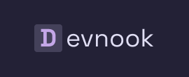
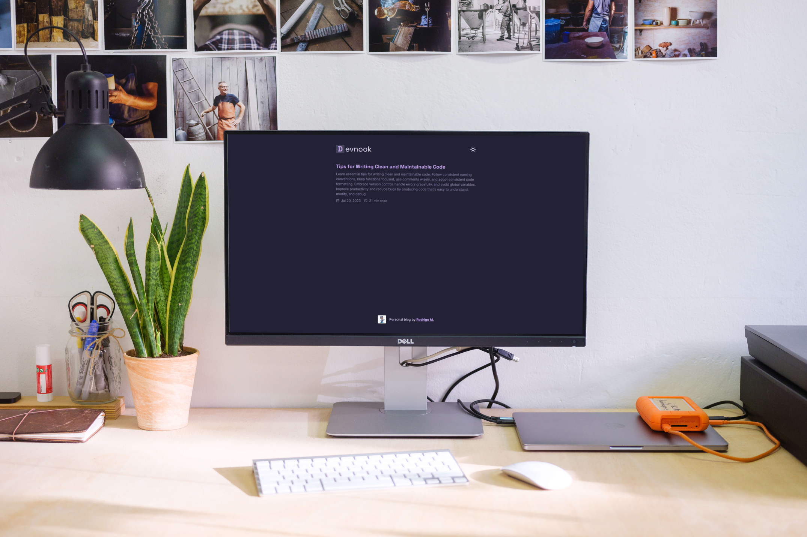

  
  
Personal blog made with nextJS

  
  

# Overview
Devnook is my personal blog made with **nextJS** and its lastest features from version 13, I also used contentlayer to so I can write the posts with **MDX**

### Features
- [x] Dark mode
- [x] Posts with mdx

### Preview
---

### 🛠 Tecnologias
---
As seguintes ferramentas foram usadas na construção do projeto:

- [NextJS](https://nextjs.org/)
- [TailwindCSS](https://tailwindcss.com/)
- [TypeScript](https://www.typescriptlang.org/)
- [Contentlayer](https://www.contentlayer.dev/)

### Autor
---

<a href="https://rod-portfolio.vercel.app">
 
  
 <b>Rodrigo Marques</b></a>

Made with ❤️ Rodrigo Marques 👋🏽 Stay in touch!

 

